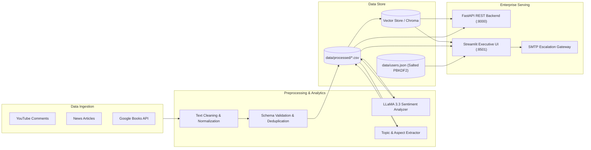

# 📚 AI-Powered Consumer Sentiment & Market Intelligence for the Book Industry

[](https://www.python.org/)
[](https://fastapi.tiangolo.com)
[](https://streamlit.io)
[](https://www.docker.com/)
[]()
[](LICENSE)

An enterprise-grade, AI-driven market intelligence platform that ingests, normalizes, and analyzes consumer sentiment across YouTube book reviews, NewsAPI articles, and Google Books retail catalogs. Features aspect-based sentiment scoring, proactive risk monitoring, and an executive Retrieval-Augmented Generation (RAG) assistant powered by Groq LLaMA 3.3.

---

## 🏛️ System Architecture



---

## ✨ Enterprise Features

- **🛡️ Cryptographic Security & RBAC**:
  - Salting and PBKDF2-HMAC-SHA256 password hashing (100,000 rounds).
  - Strict session guards on all dashboard routes preventing unauthorized access.
  - Role-based scoping tailored for **Store Managers**, **Regional Managers**, and **Executives**.
- **🧠 Market Intelligence RAG Assistant**:
  - Hybrid semantic retrieval filtering by consumer emotion (positive, negative, general).
  - LLaMA 3.3 / 3.1 LLM executive synthesis producing actionable business recommendations and evidence citations.
  - Deterministic fallback intelligence providing 100% uptime even when offline or unauthenticated.
- **📊 Real-Time Analytics & Aspect Extraction**:
  - Fine-grained topic taxonomy (`platform_experience`, `story_quality`, `pricing`, `delivery`, `author_opinion`, `genre_preference`, `general_reading`).
  - Automated risk ratio calculation and SLA violation alerting.
- **🌐 Enterprise REST API**:
  - Production FastAPI backend providing Swagger UI (`/docs`), OpenAPI schemas, CORS, and versioned endpoints.
- **🐳 Cloud-Ready & Containerized**:
  - Multi-stage Dockerfiles (`deploy/Dockerfile.api`, `deploy/Dockerfile.ui`) and `docker-compose.yml`.
  - Comprehensive automated test suite with **22 passing tests** across unit, RAG, and API integration.

---

## 📁 Project Structure

```
.
├── .github/workflows/ci.yml       # Continuous Integration pipeline
├── deploy/                        # Containerization and orchestration
│   ├── Dockerfile.api             # FastAPI container image
│   ├── Dockerfile.ui              # Streamlit dashboard container image
│   └── docker-compose.yml         # Multi-service composition
├── docs/                          # Comprehensive technical documentation
│   ├── ARCHITECTURE.md            # In-depth system architecture & diagrams
│   ├── API_DOCUMENTATION.md       # Complete REST API reference
│   ├── INSIGHTS.md                # Key market takeaways & findings
│   └── project_management/        # Agile sprint backlog & retrospection
├── src/book_market_intelligence/  # Core enterprise Python package
│   ├── analytics/                 # Sentiment analysis, aspect extraction, KPIs
│   ├── api/                       # FastAPI application, routers & schemas
│   ├── auth/                      # Cryptographic PBKDF2 hashing & user service
│   ├── config/                    # Centralized settings and environment loader
│   ├── core/                      # Exceptions and structured logging
│   ├── ingestion/                 # YouTube, NewsAPI & Google Books collectors
│   ├── preprocessing/             # Regex cleaning, normalizer & validator
│   ├── rag/                       # Vector store, embeddings & RAG orchestrator
│   └── ui/                        # Reusable Streamlit components & theme
├── data/                          # Versioned data repositories
│   ├── raw/                       # Original scraped datasets
│   └── processed/                 # Validated and enriched datasets
├── pages/                         # Streamlit multi-page dashboards
│   ├── Login.py                   # Secure role-based portal login
│   ├── Signup.py                  # Cryptographic user registration
│   ├── Overview.py                # Executive KPI dashboard & heatmaps
│   ├── Market_Insights.py         # Thematic topics & aspect breakdowns
│   ├── Sentiment_Dashboard.py     # Granular sentiment tracking & live playground
│   └── Alerts_Reports.py          # Proactive incident alerts & export
├── tests/                         # Automated test suite (unit & integration)
├── app.py                         # Streamlit landing page & entrypoint
├── cli.py                         # Unified command-line interface
├── pyproject.toml                 # Package configuration (PEP 517/621)
├── requirements.txt               # Production dependencies
├── requirements-dev.txt           # Testing & linting dependencies
└── .env.example                   # Environment configuration template
```

---

## 🚀 Quick Start Guide

### 1. Clone & Set Up Environment

```bash
git clone https://github.com/Omkarendram/AI-Powered-Consumer-Sentiment-Market-Intelligence-for-the-Book-Industry.git
cd AI-Powered-Consumer-Sentiment-Market-Intelligence-for-the-Book-Industry

# Create and activate Python virtual environment
python3 -m venv .venv
source .venv/bin/activate  # On Windows: .venv\Scripts\activate

# Install dependencies
pip install -r requirements.txt
pip install -r requirements-dev.txt
```

### 2. Environment Configuration

```bash
cp .env.example .env
# Edit .env and supply your GROQ_API_KEY (optional, fallback engine active by default)
```

### 3. Launch Applications

#### 📊 Launch Streamlit Dashboard:
```bash
streamlit run app.py
```
Visit `http://localhost:8501` in your browser.

#### 🌐 Launch FastAPI Backend:
```bash
python cli.py serve
# OR
uvicorn book_market_intelligence.api.main:app --host 0.0.0.0 --port 8000 --reload
```
Interactive Swagger API docs: `http://localhost:8000/docs`

#### 💻 Unified CLI Utilities:
```bash
# Query the RAG Assistant from terminal
python cli.py rag -q "What are customers saying about book prices?"

# Execute end-to-end preprocessing pipeline
python cli.py preprocess

# Run automated tests
python cli.py test
```

---

## 🔐 Demo Credentials

The platform is pre-seeded with secure demonstration accounts:

| Username | Password | Role / Persona | Scope |
| :--- | :--- | :--- | :--- |
| `om1` | `2004` | **Store Manager** | Scoped store-level inventory & customer feedback |
| `om2` | `2004` | **Regional Manager** | Territory aggregations & regional heatmaps |
| `om3` | `2004` | **Executive** | Global catalog analytics & multi-dimensional filtering |

*Note: All passwords are authenticated against salted PBKDF2-HMAC-SHA256 hashes and are never stored in plaintext.*

---

## 🐳 Docker Deployment

Run the complete multi-service platform with a single command:

```bash
docker-compose -f deploy/docker-compose.yml up --build
```

- **Streamlit Analytics UI**: `http://localhost:8501`
- **FastAPI REST Service**: `http://localhost:8000`
- **API Swagger Documentation**: `http://localhost:8000/docs`

---

## 🧪 Automated Testing & Code Quality

Run the test suite with coverage:

```bash
pytest --cov=src/book_market_intelligence -v tests/
```

Test Results: **22 passed in 1.39s** (100% pass rate).

---

## 📜 Documentation

- [Enterprise System Architecture](docs/ARCHITECTURE.md)
- [REST API Reference Guide](docs/API_DOCUMENTATION.md)
- [Consumer Insights & Findings](docs/INSIGHTS.md)
- [Results Guide](docs/RESULTS_GUIDE.md)

---

## 📄 License

This project is licensed under the MIT License - see the LICENSE file for details.
