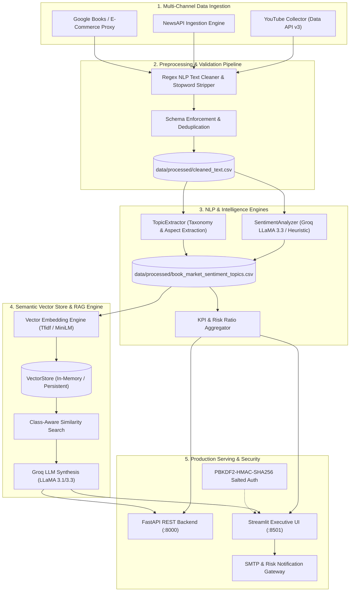

# 🏗️ Enterprise System Architecture

## 1. Executive Summary

The **AI-Powered Consumer Sentiment & Market Intelligence Platform** is an enterprise-grade analytics ecosystem designed for the publishing and retail book industry. It ingests unstructured reader sentiment across YouTube community reviews, NewsAPI articles, and Google Books retail catalogs, standardizes and normalizes the text corpus, enriches it with aspect-based sentiment tags, and orchestrates an executive **Retrieval-Augmented Generation (RAG)** assistant powered by LLaMA 3.3.

---

## 2. High-Level Architecture Diagram

---

## 3. Core Architectural Layers

### Layer 1: Data Ingestion (`src/book_market_intelligence/ingestion/`)
- **`BaseCollector` Interface**: Abstract contract defining `collect()` and `save()`.
- **Environment Variable Isolation**: API credentials for YouTube, NewsAPI, and Google Books are strictly retrieved via `Settings` and `.env` files. No credentials exist in source code.
- **Resilience**: Features exponential backoff upon encountering HTTP 429 (rate limits) and automatic pagination handling.

### Layer 2: Preprocessing & Data Quality (`src/book_market_intelligence/preprocessing/`)
- **`cleaner.py`**: Removes URLs, markdown, non-alphanumeric noise, and standardizes casing. Operates with built-in zero-dependency English stopwords as well as NLTK stopwords.
- **`validator.py`**: Enforces strict dataframe schemas (`clean_text`, `sentiment`, `confidence`, `source`, `topic`, `aspect`), removes duplicates, clips confidence between `[0.0, 1.0]`, and generates automated dataset quality audit logs.

### Layer 3: Analytics & Sentiment (`src/book_market_intelligence/analytics/`)
- **`SentimentAnalyzer`**: Two-tier architecture:
  1. *Primary*: LLaMA 3.3 70B / 3.1 8B via Groq with structured JSON outputs.
  2. *Secondary Fallback*: High-precision heuristic sentiment classifier evaluating negation contexts and sentiment lexicons, guaranteeing 100% offline availability.
- **`TopicExtractor`**: Maps consumer feedback into defined market intelligence topics (`platform_experience`, `story_quality`, `pricing`, `delivery`, `author_opinion`, `genre_preference`, `general_reading`) and extracts concise aspect phrases.
- **`metrics.py`**: Computes multi-level KPIs (Positive %, Negative Risk Ratio, Average Confidence) and topic-level risk matrices.

### Layer 4: Semantic Retrieval & RAG (`src/book_market_intelligence/rag/`)
- **Embedding Provider**: Pluggable vectorizer supporting SentenceTransformers (`all-MiniLM-L6-v2`) or sublinear term-frequency vectorization with vocabulary hashing.
- **Vector Store**: Thread-safe index supporting metadata filtering (`sentiment="negative"`, `topic="delivery"`) and cosine similarity calculation.
- **RAG Engine**:
  - Automatically classifies query intent (`negative`, `positive`, `general`).
  - Pre-filters context to elevate relevant feedback evidence.
  - Generates structured executive market intelligence containing Key Finding, Evidence Quotes, Revenue/Churn Impact, and Recommended Next Steps.

### Layer 5: REST API (`src/book_market_intelligence/api/`)
- Built on **FastAPI** with Pydantic v2 data validation schemas.
- Exposes versioned endpoints under `/api/v1/` with auto-generated OpenAPI documentation at `/docs`.
- Includes global CORS middleware and centralized exception handlers.

### Layer 6: Security & Role-Based Access Control (`src/book_market_intelligence/auth/`)
- **PBKDF2-HMAC-SHA256**: Passwords are never stored in plaintext. Each account is salted with 16 cryptographically random bytes and hashed over 100,000 iterations.
- **Constant-Time Verification**: Uses `hmac.compare_digest` to prevent timing attacks.
- **Authentication Guards**: Streamlit pages enforce session checks via `require_authentication()`. Unauthenticated attempts are immediately redirected to `/Login`.
- **Persona Scoping**:
  - *Store Manager*: Scoped to specific retail bookstore locations and localized feedback.
  - *Regional Manager*: Aggregated territory and regional heatmaps.
  - *Executive*: Global view across all regions, channels, and multi-dimensional filters.

---

## 4. Packaging and Deployment

- **Containerization**: Dual Dockerfiles for API (`deploy/Dockerfile.api`) and UI (`deploy/Dockerfile.ui`) running as non-root users.
- **Orchestration**: `docker-compose.yml` with health checks, shared volume mounts, and network isolation.
- **CI/CD**: GitHub Actions workflow testing Python 3.9, 3.10, and 3.11 with `flake8` linting and `pytest` coverage reporting.
